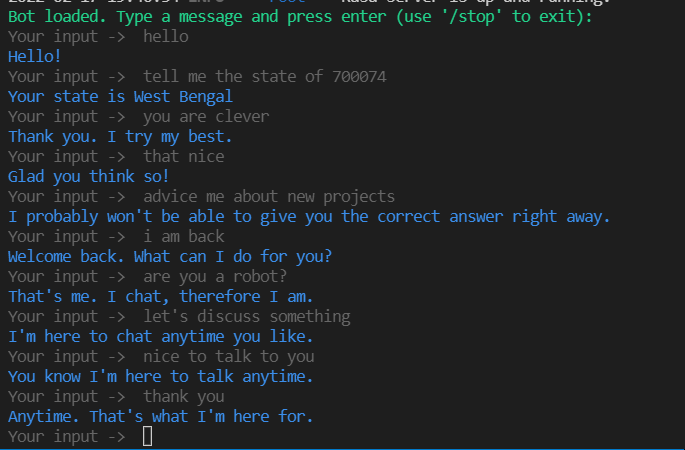
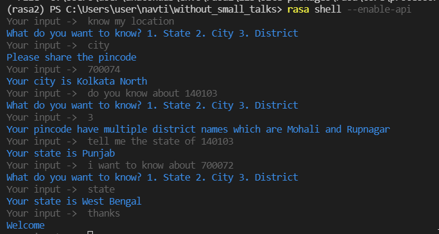

# navti 

Before runnnig the bot shell please fix [issue](https://forum.rasa.com/t/error-asyncio-task-exception-was-never-retrieve/15511/6) by changing value of `DEFAULT_STREAM_READING_TIMEOUT_IN_SECONDS` as mentioned.

## Screenshot 
### With small talk 

### Without small talk 

